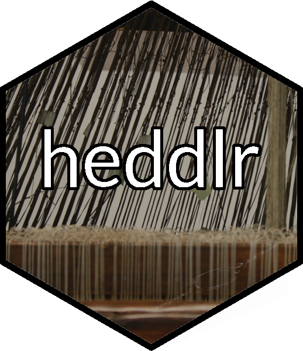

<!-- README.md is generated from README.Rmd. Please edit that file -->
heddlr: Functional Programming Concepts for R Markdown Documents
================================================================

<!-- badges: start -->

<!-- badges: end -->

[R Markdown](https://github.com/rstudio/rmarkdown) is an incredible
tool, allowing you to trivially create professional-quality HTML (and
PDF and more) documents from simple Markdown documents. However, if
those documents have sections which repeat multiple times for different
slices of your data, you can wind up spending a lot of time copying and
pasting parts of your document. This can make it tricky to update your
documents if you decide you want to tweak pieces of your report, and can
force you to spend a lot of time updating and double-checking your
document if you’re trying to report on information from an changing data
set.

`heddlr` seeks to address these challenges by providing tools to make
your R Markdown DRYer (that is, [don’t repeat
yourself.](https://r4ds.had.co.nz/functions.html#when-should-you-write-a-function).
By making it easier to dynamically piece together components of your
document based on your data source, `heddlr` makes it easier for you to
write cleaner documents and create your reports faster.

For examples of what this looks like, check out the [intro
vignette](https://mikemahoney218.github.io/heddlr/articles/modular-reporting-with-heddlr.html)
and the [more involved
example.](https://mikemahoney218.github.io/heddlr/flights-example/flexdashboards-with-heddlr.html)
For more information on where development is headed, check out [The Road
to 0.5.0](https://github.com/mikemahoney218/heddlr/issues/1).

Installation
------------

If the CRAN version badge above is green, you can install the released
version of heddlr from [CRAN](https://CRAN.R-project.org) with:

    install.packages("heddlr")

You can always get the most up-to-date stable version with:

    # install.packages("devtools")
    devtools::install_github("mikemahoney218/heddlr")

And the unstable development version via:

    # install.packages("devtools")
    devtools::install_github("mikemahoney218/heddlr", refs = "development")
